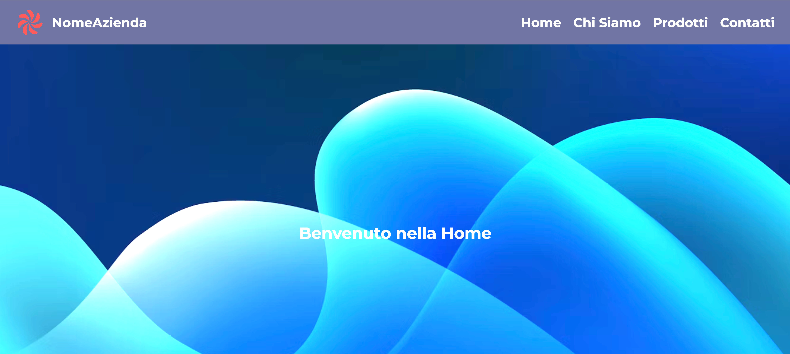

# Esercizio layout bootstrap
## Sito riprodotto durante corso Frontend Developer
*Ottobre 2025*  👨🏻‍💻


---

🔨
| Nome | Linguaggio | Versione |
|------|------------|----------|
| Html | Markup     | 5        |
| CSS  | Style      | 4        |




🖥️
```bash
